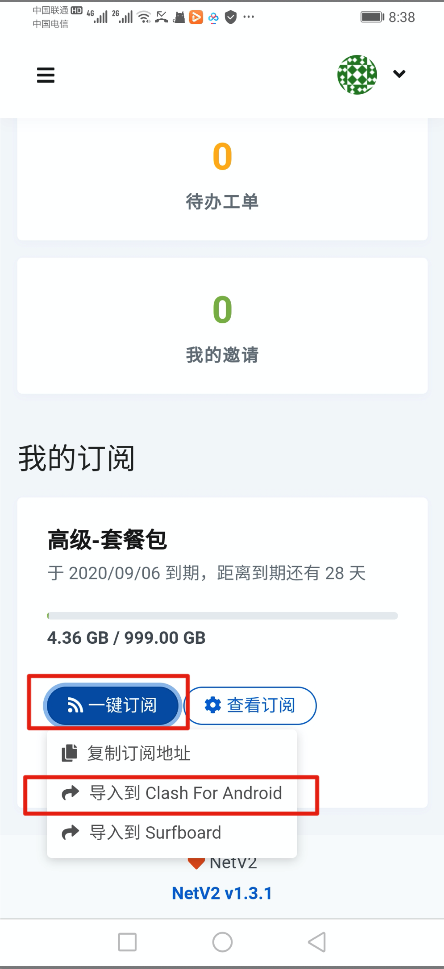
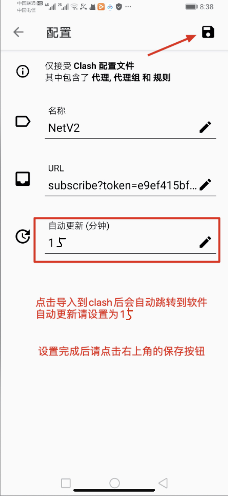
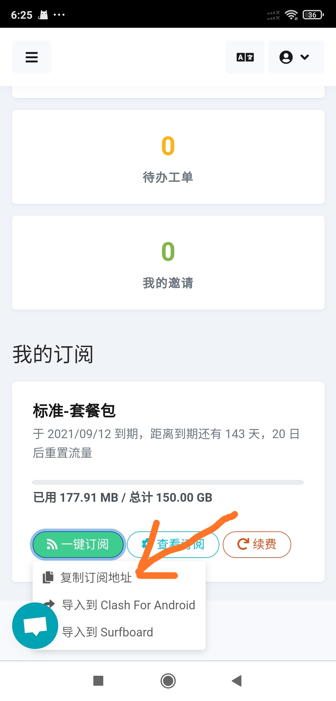
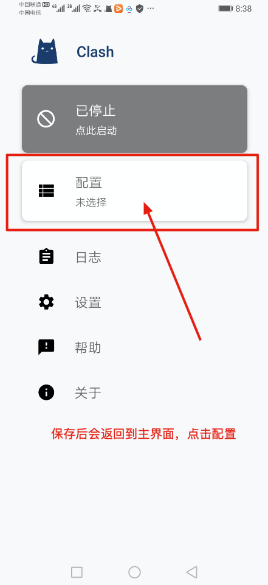
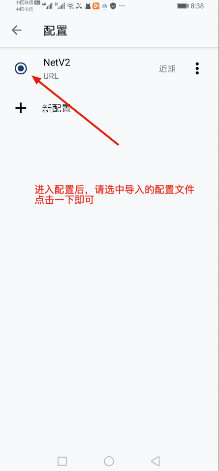
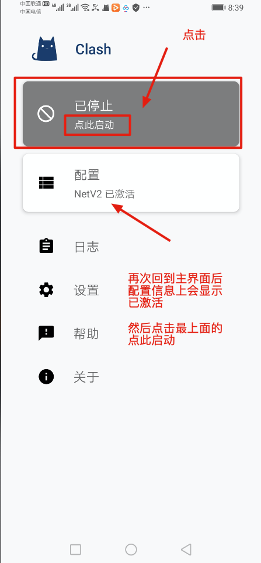
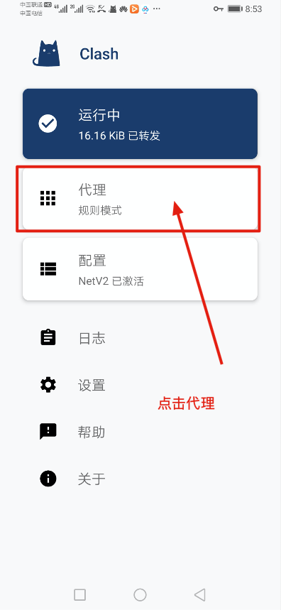
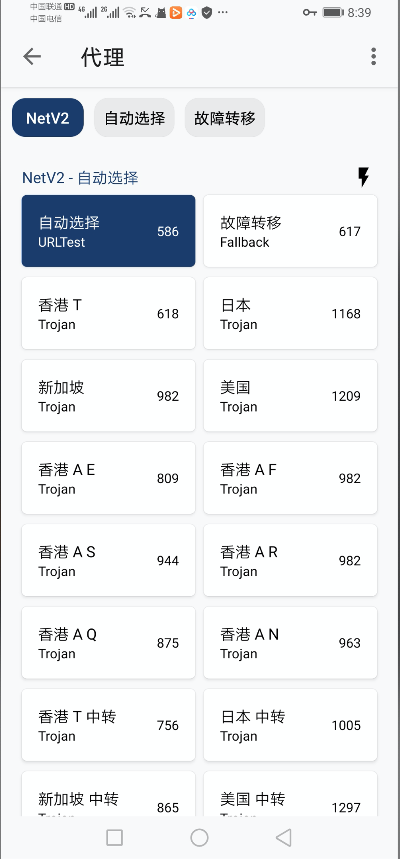
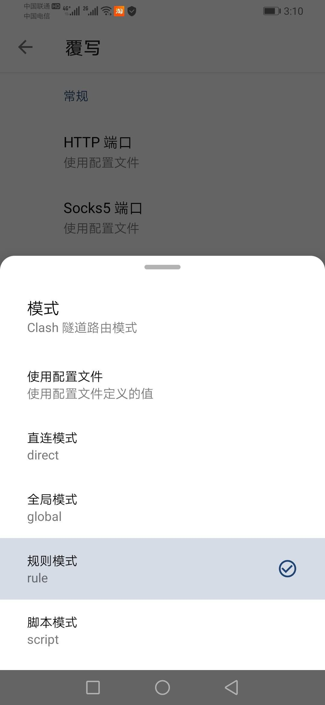
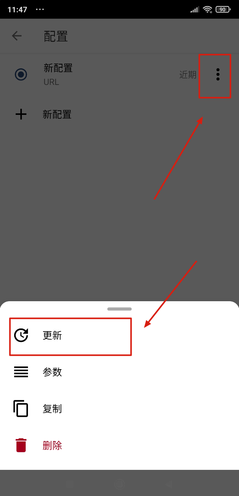

# 安卓Clash图文教程

## 软件下载地址

### 系统应为安卓7.0以上（版本1用不了请用版本2，如果安装有问题请联系客服解决）



[下载地址1](https://pan.ututools.com/onedrive/01_%E8%BD%AF%E4%BB%B6/07_%E9%AD%94%E6%B3%95%E4%B8%8A%E7%BD%91/CLASH/app-arm64-v8a-release%20%28v2.3.21%29.apk)

[下载地址2](https://airnet.lanzoui.com/iAbHvq8jsub)



[下载地址1](https://pan.ututools.com/onedrive/01_%E8%BD%AF%E4%BB%B6/07_%E9%AD%94%E6%B3%95%E4%B8%8A%E7%BD%91/CLASH/app-armeabi-v7a-release%20%28v2.3.21%29.apk)

[下载地址2](https://airnet.lanzoui.com/id9q6q8jsxe)



## Clash软件图文教程

### 1.主界面软件

### 2.导入订阅（分为一键导入和手动导入）



### 2.1.1 打开[官网](https://netv2.top/)主页点击一键订阅（建议使用手机自带浏览器打开，QQ，微信，百度内无法自动跳转）

### 2.1.2 点击导入到clash后，会自动跳转到小猫咪内，自动更新设置为15，最后点击右上角的保存按钮




### 2.2.1 打开[官网](https://netv2.top/)主页点击一键订阅，复制订阅地址，

### 2.2.2 打开Clash软件主界面的配置→新配置→Url 来进入下面的界面，手动把订阅链接粘贴到URL里）




### 3.保存后，会自动返回到主界面，点击配置。

### 4.进入配置后，选中刚刚导入的配置文件，然后点左上角按钮返回

### 5.这时主界面已经显示配置文件已激活，点击最上面的已停止按钮，就可以启动了

### 6.启动后，会弹出代理选项，点击进入

### 7.进入后可以看到服务器节点，向下滑动即可显示出节点数值，选择有数值的节点进行连接。\(别用自动选择\)

### 8.连接后，可以打开[www.YouTube.com](https://youtube.com/)测试一下，如果油管可以打开就说明已经成功

### 9.如果需要选择模式，请在主界面点击 （设置），然后点击 （覆写），再点击 （模式）

> 直连模式：全部国内国外走不走节点流量（相当于没开clash）
>
> 全局模式：全部国内国外都走节点流量（有可能导致访问国内比较卡）
>
> 规则模式：属于国内直连，国外自动走节点流量（建议使用）

### 10.手动更新，虽然设置了自动更新，也可以定期手动更新一下更稳妥

### 11.点击主界面的配置，配置文件右上角有三个点，呼出菜单

