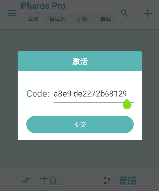
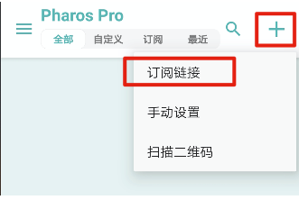
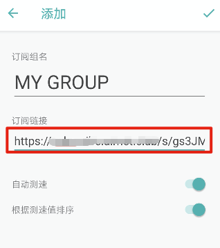
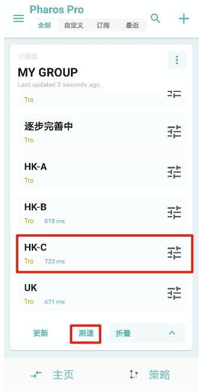
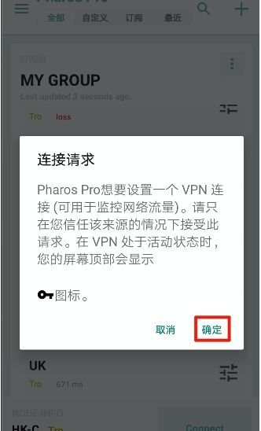
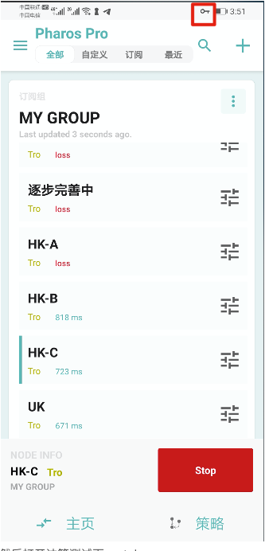
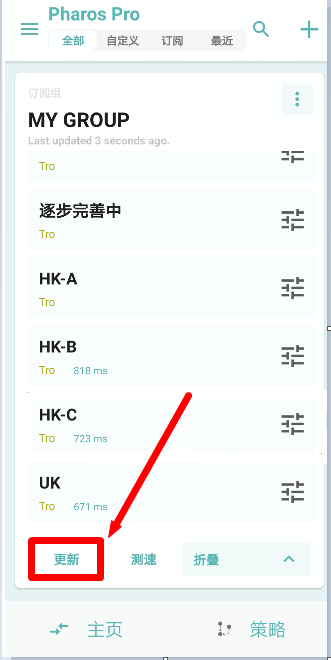

# Pharos Pro图文教程

## 软件下载地址

#### 系统应为安卓7.0以上（部分安卓机型闪退，请使用Clash）

#### [下载软件](https://airnet.lanzous.com/iPcIOnsimbc)

## Pharos Pro图文教程

### **1.安装好软件后，打开软件，点击确定**


### **2.输入软件激活码，注意不要有空格或者回车，然后点击提交**

#### **软件激活码**

```text
dcb0628a-9b87-4184-a8e9-de2272b68129
```



### **3.打开**[**官网**](https://dukufast.cyou/)**主页点击一键订阅，复制订阅地址**


### 4.**然后打开软件，点击右上角加号，订阅链接**



### 5.**把从网站内复制的订阅链接粘贴进去**



### 6.**添加后主界面会显示节点，往下翻到最下面，点击测速，选择一个有数值的节点**



### 7.**点击节点就可以连接，弹出对话框请点确定**



### 8.**连接成功后，软件界面会如下图**



### 9.连接后，可以打开[www.YouTube.com](https://youtube.com/)测试一下，如果油管可以打开就说明已经成功

### 10.**请定期更新订阅\(反倒最下面，关闭代理后再更新\)，会将网站上最新的节点同步到手机软件内。**



