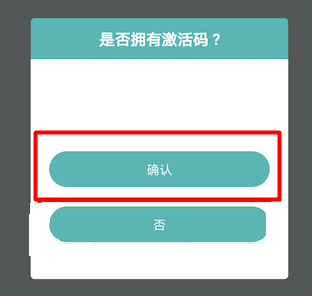
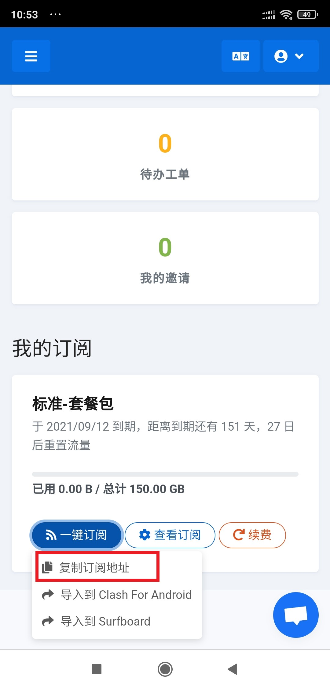

# 安卓Pharos Pro图文教程

## 软件下载地址

### 系统应为安卓7.0以上（部分安卓机型闪退，请使用Clash）

> [下载地址1](https://pan.ututools.com/onedrive/01_%E8%BD%AF%E4%BB%B6/07_%E9%AD%94%E6%B3%95%E4%B8%8A%E7%BD%91/%E6%B0%B4%E6%BB%B4/PharosPro155.apk)
>
> [下载地址2](https://airnet.lanzoui.com/ixbxYq8k1za)

## Pharos Pro图文教程

### **1.安装好软件后，打开软件，点击确定**



### **2.输入软件激活码，注意不要有空格或者回车，然后点击提交**

#### **软件激活码** 

```text
dcb0628a-9b87-4184-a8e9-de2272b68129
```


### 3.打开浏览器输入官网地址：[https://netv2.top](https://netv2.top) 登录后点击一键订阅，复制订阅地址



### 4.**然后打开软件，点击右上角加号，订阅链接**


### 5.**把从网站内复制的订阅链接粘贴进去**


### 6.**添加后主界面会显示节点，往下翻到最下面，点击测速，选择一个有数值的节点**


### 7.**点击节点就可以连接，弹出对话框请点确定**


### 8.**连接成功后，软件界面会如下图**


### 9.连接后，可以打开[www.YouTube.com](https://youtube.com/)测试一下，如果油管可以打开就说明已经成功

### 10.**请定期更新订阅\(反倒最下面，关闭代理后再更新\)，会将网站上最新的节点同步到手机软件内。**


