# V2rayNG 图文教程

## 软件下载地址

#### 系统应为安卓7.0以上（版本1用不了请用版本2，如果安装有问题请联系客服解决）

#### [1下载](https://airnet.lanzous.com/iIlE7okx4wd)

#### [2下载](https://pan.ututools.com/onedrive/01_%E8%BD%AF%E4%BB%B6/07_%E9%AD%94%E6%B3%95%E4%B8%8A%E7%BD%91/V2flyNG.apk)

## V2rayNG软件图文教程

### 1.主界面软件 

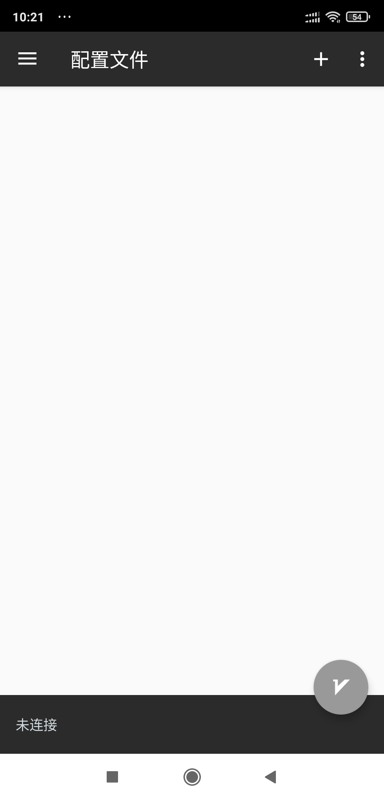

### 2.点击左上角呼出菜单，进入订阅设置

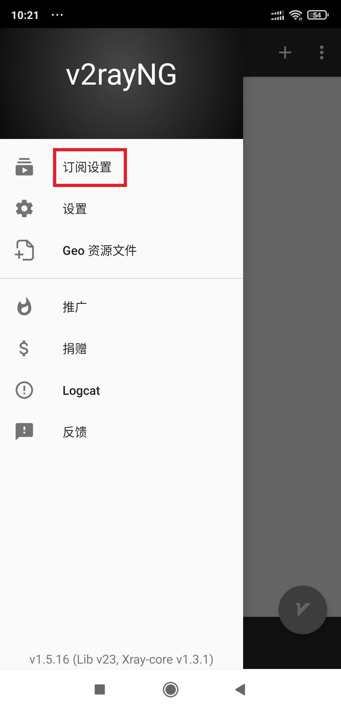

### 3.点击右上角 ＋

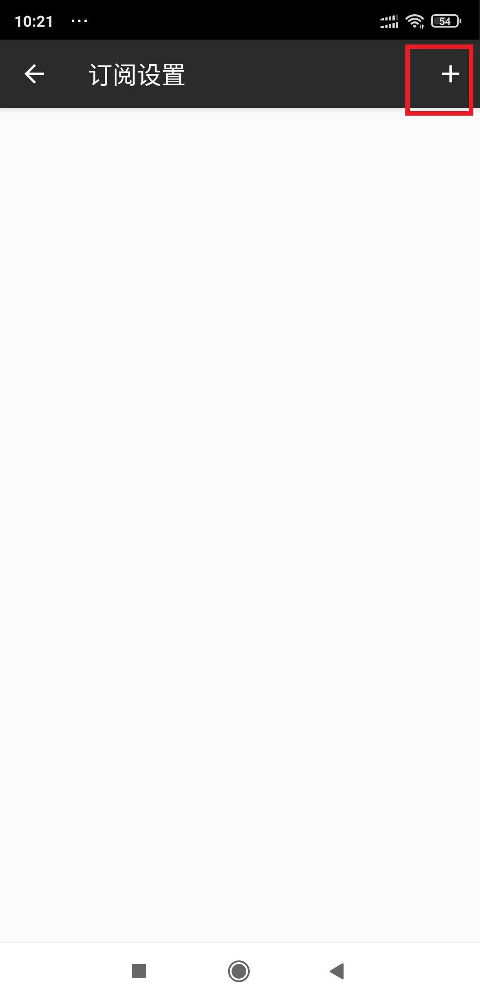

### 4.在[官网](https://netv2.top/)主页点击一键订阅，复制订阅地址

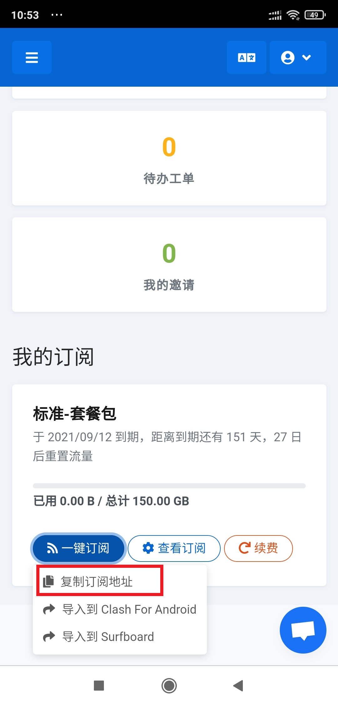

### 5.重新回到软件内，把订阅粘贴到地址里，备注随便填，最后右上角对勾保存

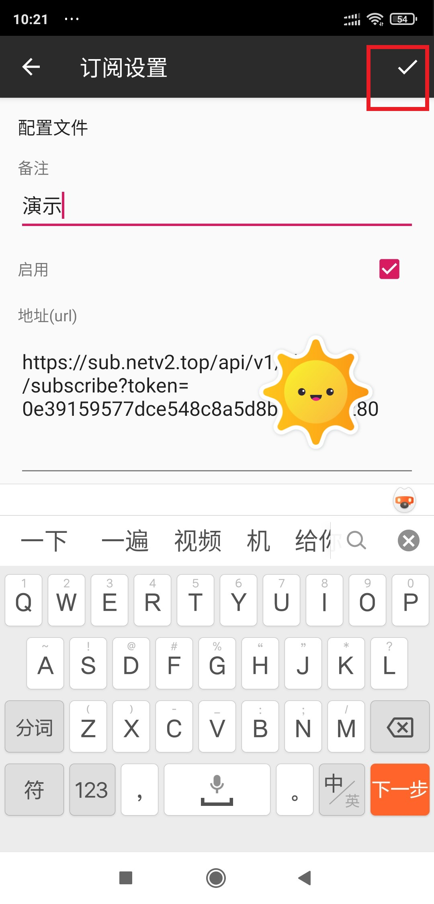

### 6.点击返回，回到主界面

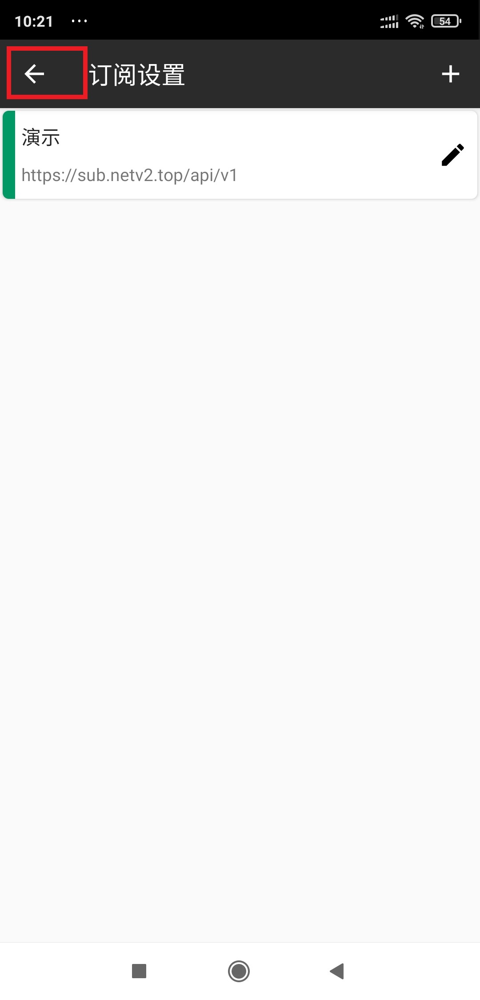

### 7.回到主界面后，点击右上角三个点，点击更新订阅

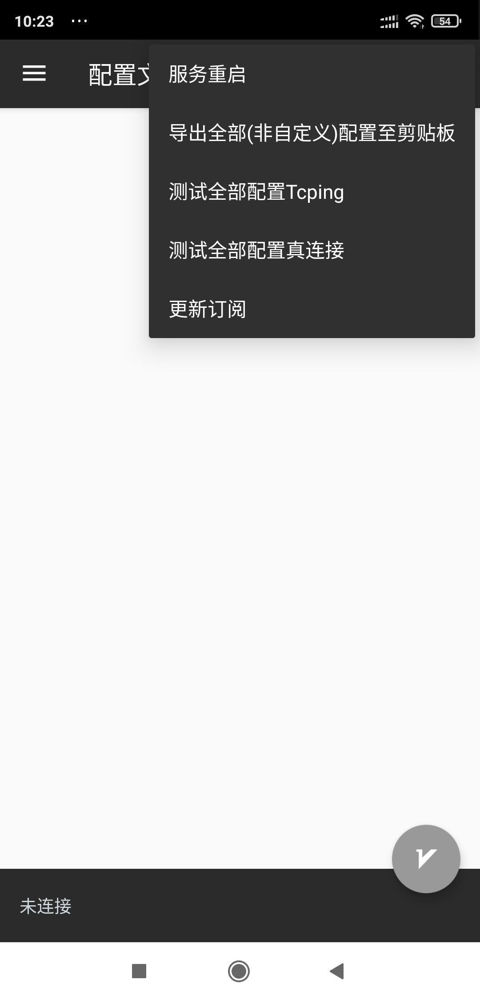

### 8.更新后节点会显示，再次点击右上角，点击测试真连接

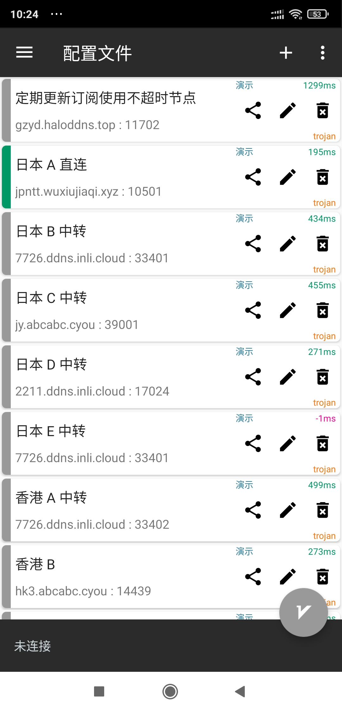

### 9.选择一个有数值的节点，选中后点击右下角圆圈按钮。启动后会变成绿色

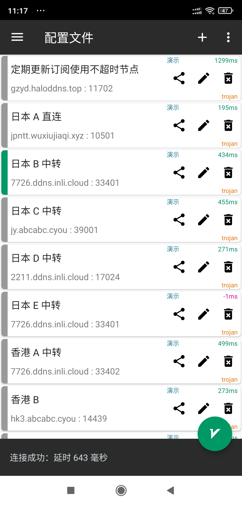

### 10.连接后，可以打开[www.YouTube.com](https://youtube.com/)测试一下，如果油管可以打开就说明已经成功

### 11.选择模式，主界面点击左上角呼出菜单，点击设置，选择预定义规则。（建议使用绕过大陆地址）

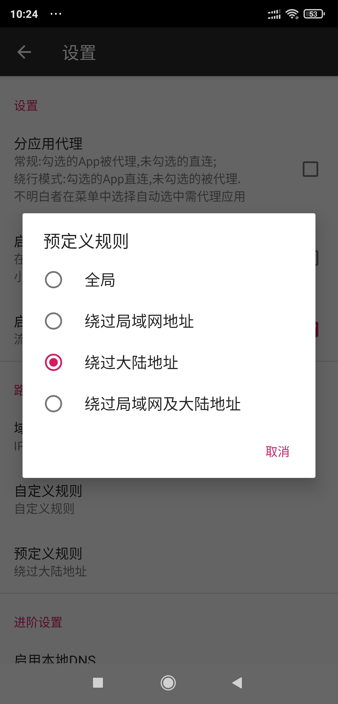

> 全局：全部国内国外都走节点流量（有可能导致访问国内比较卡）
>
> 绕过大陆地址：属于国内直连，国外自动走节点流量（建议使用）

### 12.定期更新订阅，把最新的节点同步到手机上，（更新时建议先关闭代理，否则可能更新失败）

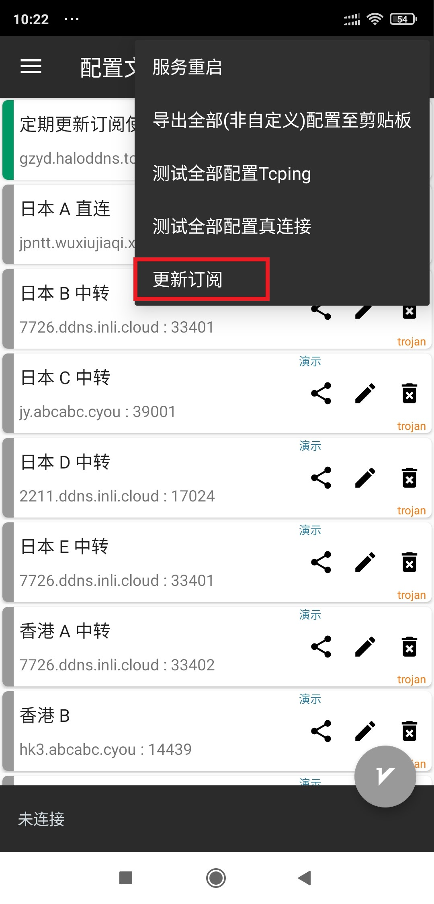

