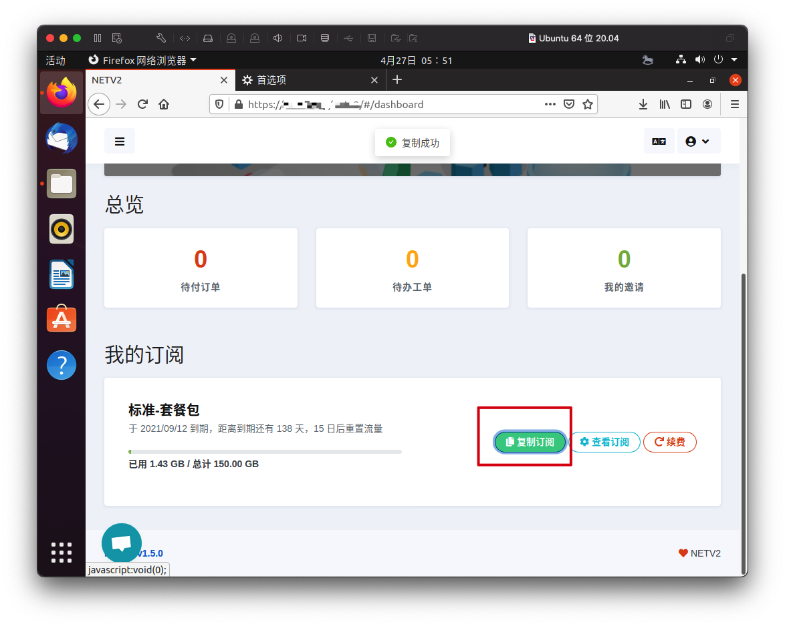
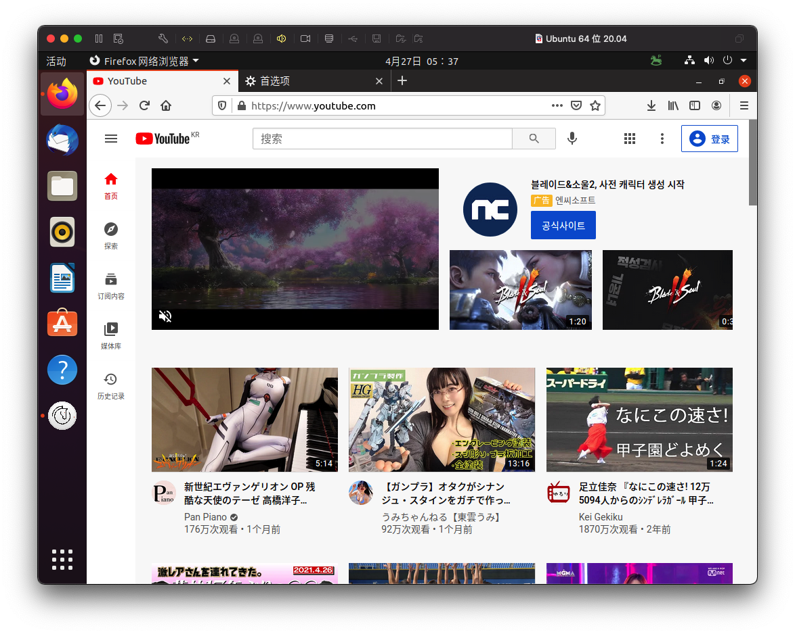

# Linux Trojan-QT5 使用教程

## 软件下载地址

#### Ubuntu电脑系统应为Ubuntu 18及以上

#### [软件下载地址1](https://airnet.lanzous.com/iPyZIoi6xsj)

#### [软件下载地址2](https://pan.ututools.com/onedrive/01_%E8%BD%AF%E4%BB%B6/07_%E9%AD%94%E6%B3%95%E4%B8%8A%E7%BD%91/TrojanQT5/Trojan-Qt5-Linux.AppImage)

## Trojan-QT5软件图文教程\(教程系统为Ubuntu 20\)

### 1. 下载软件后，右键点击属性

### 2. 点击权限，把允许执行文件勾选上☑️

### 3. 双击打开软件进入主界面

### 4. 点击右上角状态栏上的小马图标，点击服务器订阅菜单下的服务器订阅设置

### 5. 弹出服务器订阅窗口后，点击添加

### 6. 登录官网主页点击复制订阅

### 7. 把网址窗口清空，然后把订阅地址粘贴进去，最后点击确定

### 8. 再次点击右上角状态栏的小马，点击服务器订阅设置下的更新服务器订阅\(不通过代理\)

### 9. 节点就全部更新出来了

### 10. 右键点击主界面，选择测试所有连接的延迟。然后滚动下鼠标滚轮节点就显示出数值了

### 11. 任意选中一个节点，再点击连接，或者直接双击就可以连接了。（连接后状态栏小马图标会变颜色）

### 12. 点小马图标，选择PAC模式，选定更新为绕过大陆增强域名列表（注意是增强）

### 12. 然后打开[www.youtube.com](www.youtube.com) 测试一下，可以正常访问，如果不能访问请检查浏览器代理设置是否为系统代理

### 14. 如果需要选择模式，请在点击小马图标（建议使用PAC模式）

> 直连模式：代表直连模式，全部国内国外走不走节点流量（相当于没开）
>
> PAC模式：代表规则模式，属于国内直连，国外自动走节点流量（建议使用）
>
> 全局连接：代表全局模式，全部国内国外都走节点流量（有可能导致访问国内比较卡）
>
> 增强模式：可能不完善建议不要使用。

## 15. 如何更新订阅

### 更新订阅有什么用？（当旧节点失效超时，更新订阅的作用是把服务器上最新的节点同步到软件内）

### 15.1 软件主界面点击 断开连接  断开当前节点的连接

### 15.2 按住鼠标选中节点然后往下拉，会多选节点，然后点击删除

### 15.3 删除全部节点后，在点击小马图标，服务器订阅设置下的 更新订阅不通过代理

### 15.4 然后重新按照第10步，继续操作即可  

