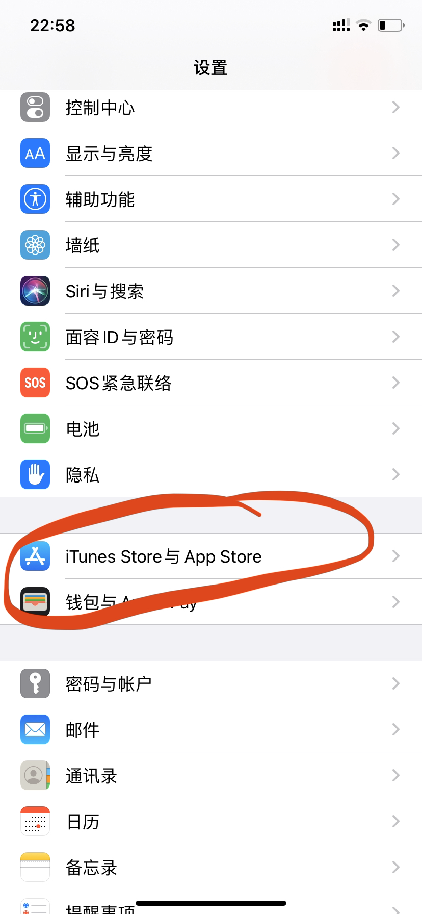
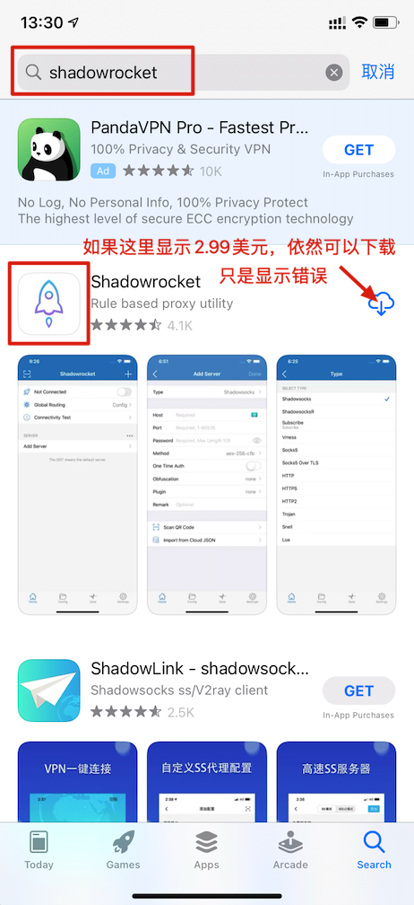
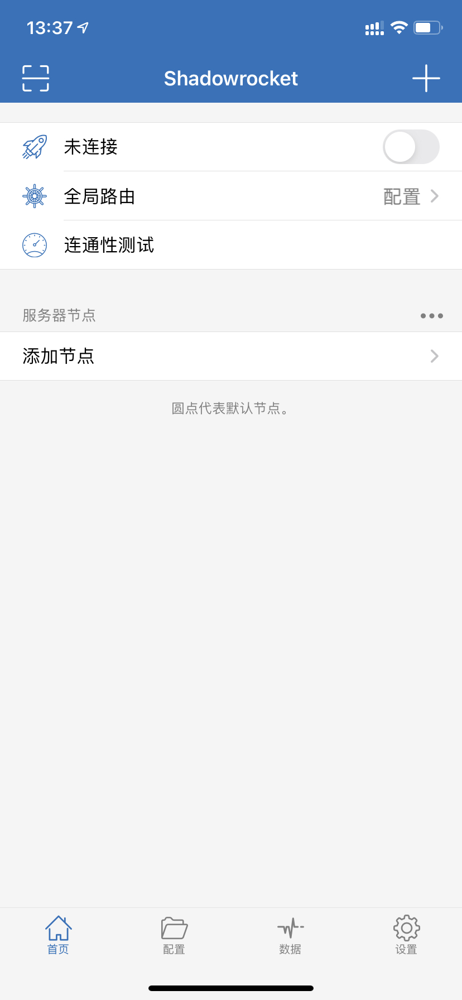
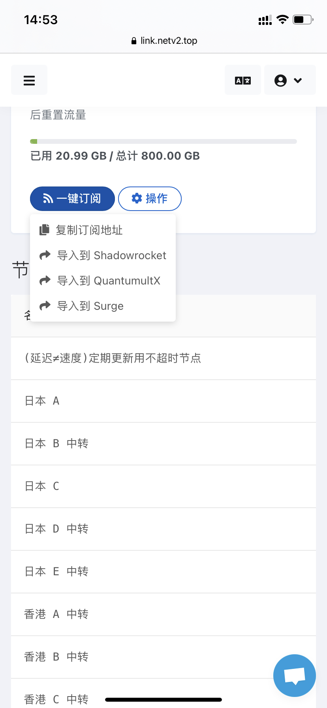
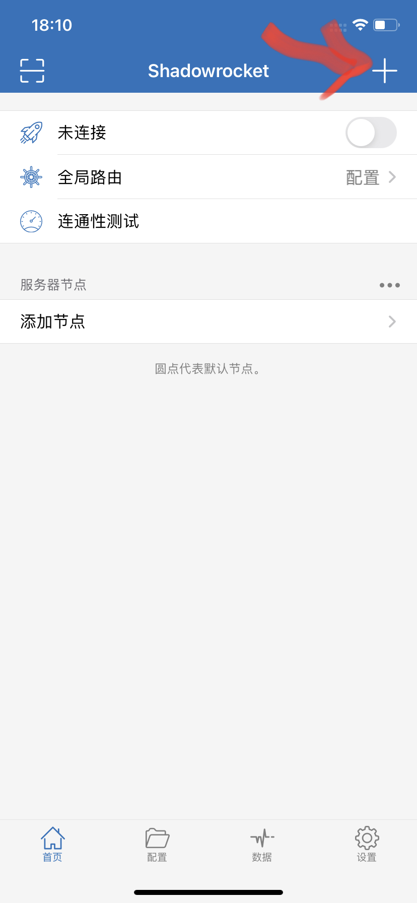
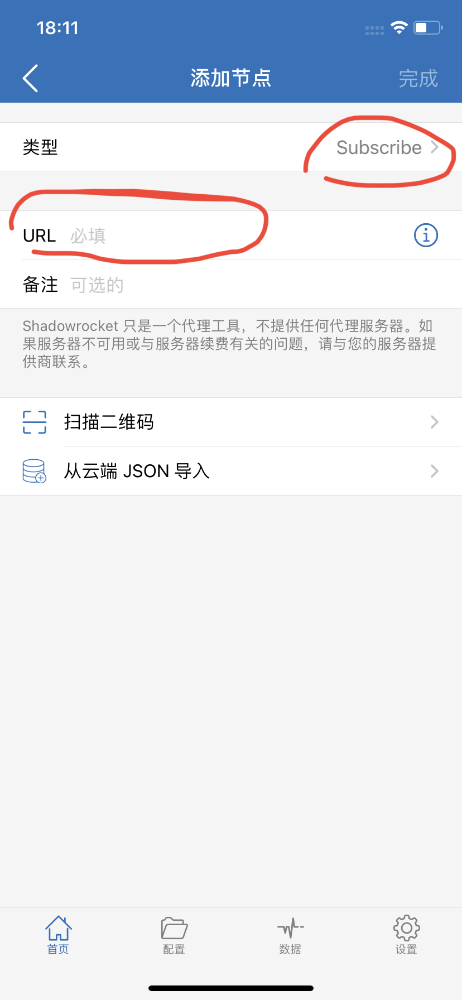
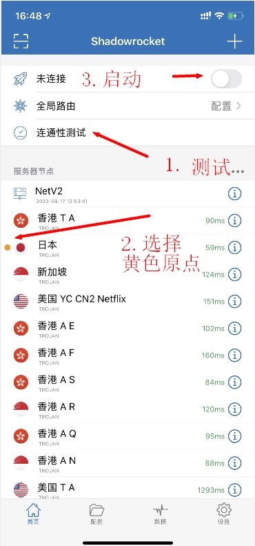
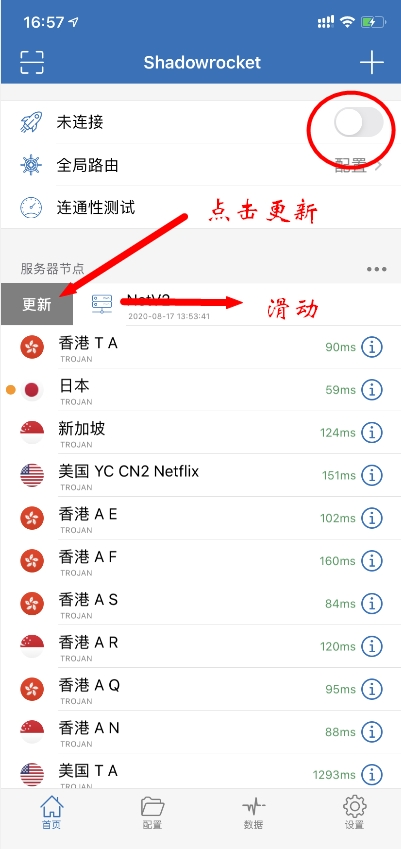
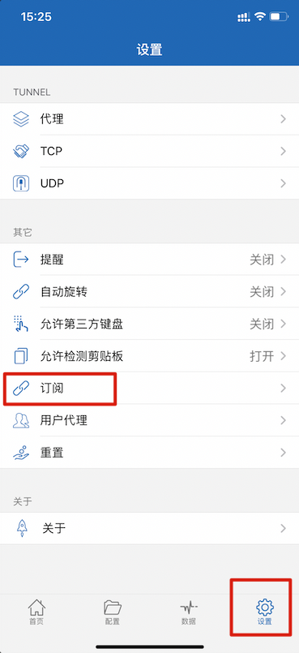
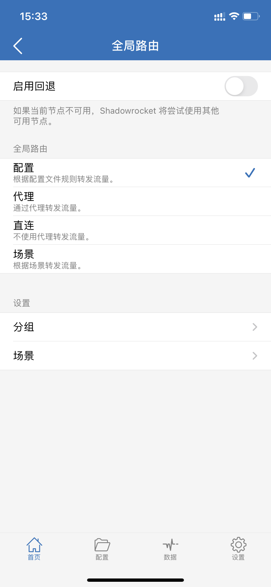

# Shadowrocket小火箭图文教程

## 下载软件教程

#### Shadowrocket（俗称小火箭）售价3美元且只能在国外App Store进行下载，所以要切换国外ID将商店切换到国外，这边提供了美区ID进行免费下载。

登录ID需要加客服提供登录短信验证码

> 客服微信netv22
>
> 客服QQ2175944130

### 美区苹果ID账号密码

#### Apple ID账号（登录时如果提示密码错误，请查看账号有没有多余空格）

```text
netv2@foxmail.com
```

#### Apple ID 密码（登录时如果提示密码错误，请注意密码有大小写）

```text
Tr998877
```

### 1. IOS14 和IOS13包括以往版本登录商店位置不同，请参考图片



#### **IOS 14**位置（点击设置→最上面的头像→点击媒体与购买项目→点击退出登录→然后登录上面提供的ID）





#### IOS 13和以往版本位置（点击设置→往下翻到隐私下面点击iTunes与App Store→然后退出你的ID→登录上面提供的美区ID）





### 2. 成功登录后，打开App Store商店（商店变为英文表示登录成功，如果还是显示中文，请强行关闭商店后重新打开，如果还不行，请退出ID重新登录）。然后搜索shadowrocket下载（如图）



## 软件使用教程

### 1. 下载后的软件主界面如图



### 2. 导入订阅（分为一键导入和手动导入）



### 2.1.1 请用Safari浏览器打开[官网](https://netv2.top/)（不要在QQ内，微信内，百度内打开否则无法跳转），点击一键订阅，导入到shadowrocket。



### 2.1.2 导入后会自动跳转到小火箭shadowrocket内（注意：导入时，请保证右上角的连接按钮是关闭状态，如果导入后没显示地区节点，请后台强行关闭软件后重新打开软件就会显示了）





### 2.2.1 如果需要手动导入，请用Safari浏览器打开[官网](https://netv2.top/)，点击一键订阅复制订阅地址。


### 2.2.2 然后打开小火箭右上角的加号（注意：导入时，请保证右上角的连接按钮是关闭状态，如果导入后没显示地区节点，请后台强行关闭软件后重新打开软件就会显示了）



### 2.2.3 类型选择Subscribe，把订阅链接粘贴到URL里面，点击完成即可





#### 

### 3. 导入后，点击测试连通性，选择一个有效的（未超时）地区节点，然后点击右上角的连接按钮，第一次运行会弹出窗口，点击允许就可以了



### 4. 连接后，可以打开[www.YouTube.com](https://youtube.com/)测试一下，如果油管可以打开就说明已经成功

### 5. 手动更新订阅（更新时请，建议关闭小火箭启动按钮）



### 6. 设置自动更新订阅，点击设置，翻到最下面，点击订阅，里面可以把自动更新打开，但是平时还是建议定期手动更新下更稳妥。



### 7. 如果需要选择模式，请在主界面点击 （全局路由）

> 配置：代表规则模式，属于国内直连，国外自动走节点流量（建议使用）
>
> 代理：代表全局模式，全部国内国外都走节点流量（有可能导致访问国内比较卡）
>
> 直连：代表直连模式，全部国内国外走不走节点流量（相当于没开小火箭）
>
> 场景：配置比较复杂不建议用。



