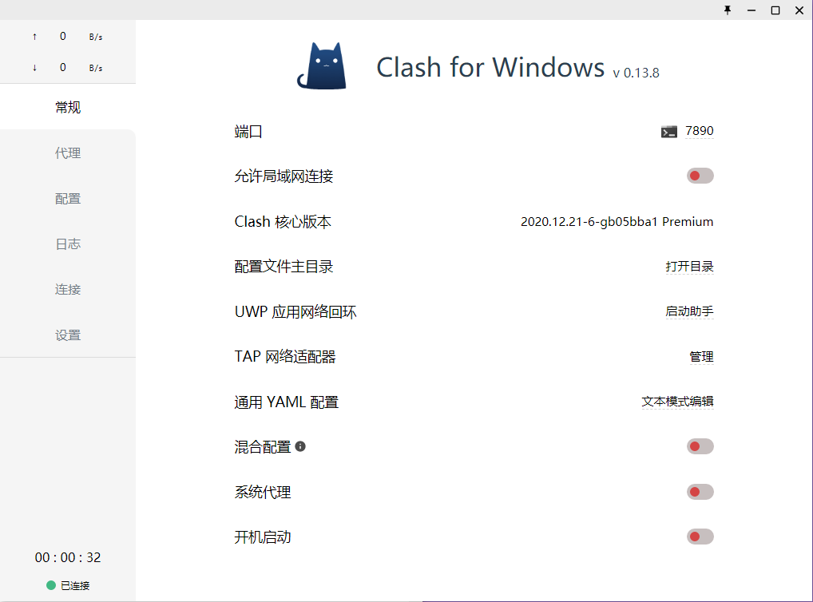
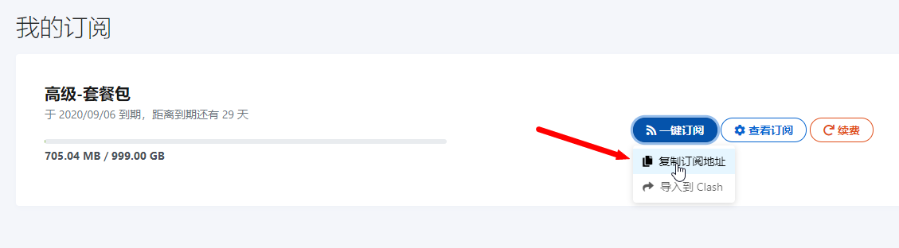
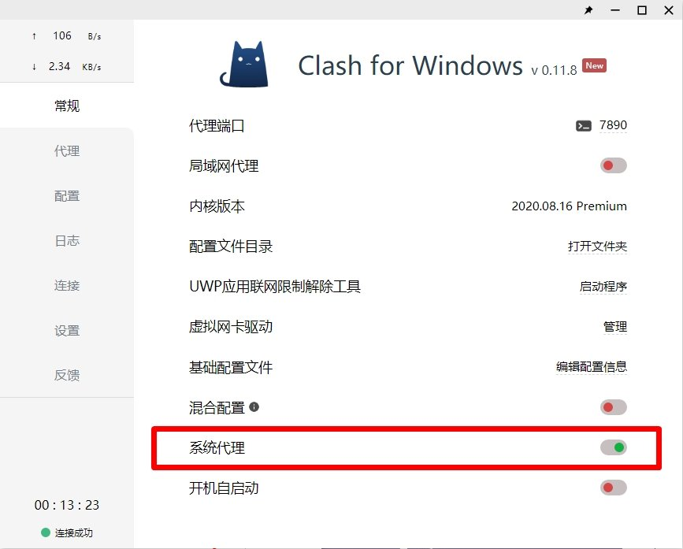
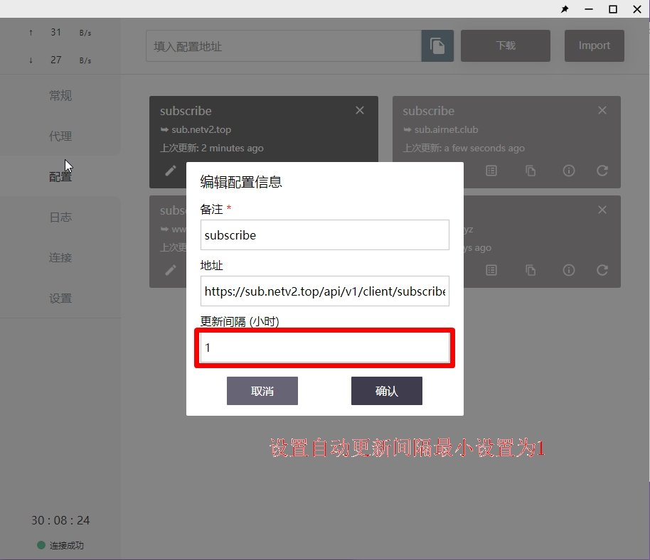
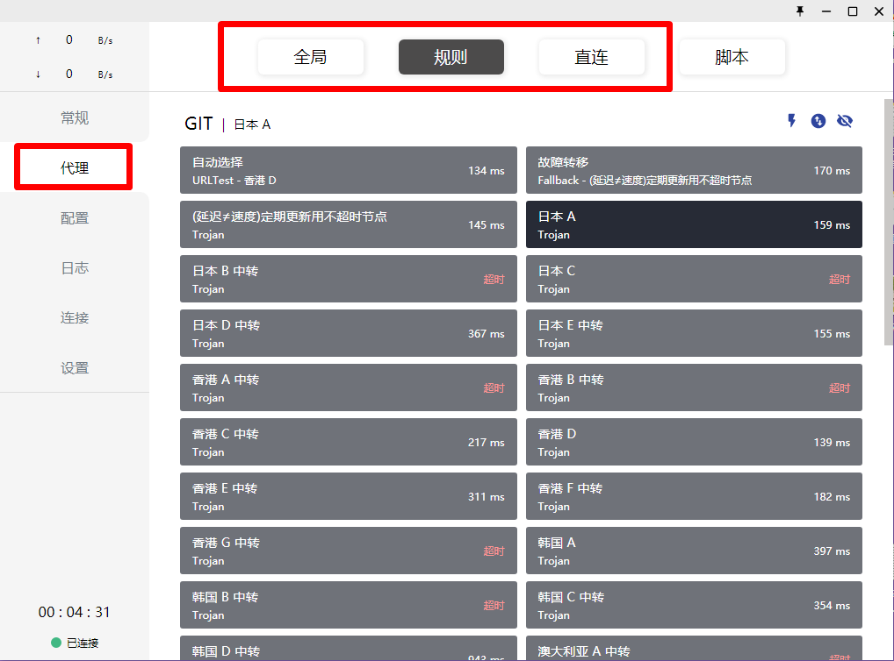

# 电脑Clash图文教程\[推荐使用\]

## 软件下载地址

### 电脑系统应为Windows 7及以上（如果不知道自己电脑是64位还是32位，请下载64，如果不能用请下载32）



[下载地址1](https://pan.ututools.com/onedrive/01_%E8%BD%AF%E4%BB%B6/07_%E9%AD%94%E6%B3%95%E4%B8%8A%E7%BD%91/CLASH/Clash.for.Windows-0.13.8-64%E4%BD%8D-netv2.7z)

[下载地址2](https://airnet.lanzoui.com/itQYKrhryje)



[下载地址1](https://pan.ututools.com/onedrive/01_%E8%BD%AF%E4%BB%B6/07_%E9%AD%94%E6%B3%95%E4%B8%8A%E7%BD%91/CLASH/Clash.for.Windows-0.13.7-32%E4%BD%8D-win.7z)

[下载地址2](https://airnet.lanzoui.com/i7Ik8juqmif)



## Clash软件图文教程

### 1. 软件下载后请全部解压到磁盘内（建议D盘），如果没有解压软件，请提前安装解压软件（比如7z，好压，360压缩等）

### 2. 主界面展示（正常使用只操作【常规，代理，配置】，这三个选项即可）

### 3. 导入订阅。分为一键导入和手动导入。



### 3.1.1  打开浏览器输入官网地址：[https://netv2.top](https://netv2.top) 登录后点击一键订阅导入到clash


注意：请使用电脑的浏览器，比如Chrome，QQ浏览器等等，电脑微信客户端内置的浏览器无法自动跳转导入）


### 3.1.2 点击后网页会把订阅自动导入到软件内，并显示出新的配置文件，然后鼠标点击一下新出现的配置文件，选中后会变成深色，未选中是浅色




### 3.2.1  打开浏览器输入官网地址：[https://netv2.top](https://netv2.top) 登录后点击一键订阅，复制订阅地址。

### 3.2.2 然后粘贴到配置页面最上面的文本框里，点击下载。导入后。会显示绿色的成功，然后鼠标点击一下新出现的配置文件，选中后会变成深色，未选中是浅色




### 4. 选好配置文件后，点侧边栏的代理，然后选择一个有数值的节点（此数值不是ping延迟）右上角的小闪电按钮可以测试节点的有效性，有数值的均可以使用

### **5. 最后点击侧边栏的常规，点击系统代理就可以启动软件了**

### 6. 连接后，可以打开[www.YouTube.com](https://youtube.com/)测试一下，如果油管可以打开就说明已经成功

### **7. 设置自动更新订阅（**自动更新的意思是会每隔多久会自动将网站上最新的服务器同步到软件内**）**

#### **7.1 点击侧边栏的配置，选择配置文件的设置按钮（如图）**

#### 7.2 然后把更新间隔设置为1。（就是每隔一个小时自动更新订阅）

### 8. 如果需要选择模式，请点击侧边栏代理，最上方（如图，建议使用规则）

> 规则：代表规则模式，属于国内直连，国外自动走节点流量（建议使用）
>
> 全局：代表全局模式，全部国内国外都走节点流量（有可能导致访问国内比较卡）
>
> 直连：代表直连模式，全部国内国外走不走节点流量（相当于没开clash）
>
> 脚本：配置比较复杂不建议用。

