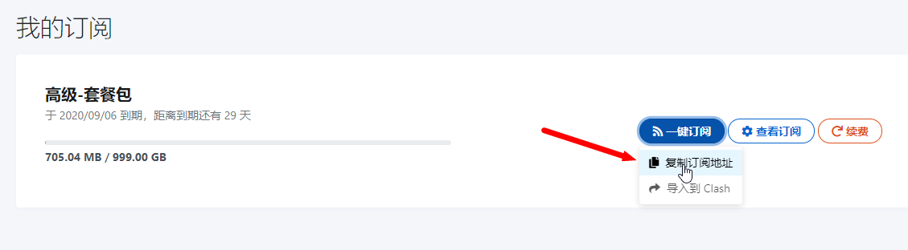

# 电脑V2rayN图文教程

## 软件下载地址

### 电脑系统应为Windows 7及以上


windows 7 系统需要提前安装好[Microsoft .NET Framework 4.6.2](https://www.microsoft.com/en-us/download/details.aspx?id=53344)


> [下载地址1](https://airnet.lanzoui.com/iCjN2j4le4h)
>
> [下载地址2](https://airnet.lanzoui.com/iCjN2j4le4h)

## V2rayN软件图文教程

### 1. 软件下载后请全部解压到磁盘内（建议D盘），如果没有解压软件，请提前安装解压软件（比如7z，好压，360压缩等）

### 2. 打开软件后，双击电脑右下角的软件图标，打开软件主界面。

### 3. 打开浏览器输入官网地址：[https://netv2.top](https://netv2.top) 登录后点击一键订阅，复制订阅地址

### 4. 在点击订阅，订阅设置。

### 5. 按照图片1.2.3顺序，先点添加，然后把订阅地址粘贴到地址里，最后点击确定

### 6. 回到主界面，再次点击订阅，点击更新订阅，节点就加载出来了。

### 7. 框选一些节点，右键测试真链接延迟，有数值的就说明节点是可用的。

### 8. 选择有一个有效的节点，按回车键或者鼠标右键点击设为活动服务器，选中后前面会显示对勾的

### 9. 右键单击电脑右下角的软件图标，弹出的菜单选择Http代理，选择开启PAC模式（建议使用PAC）或者全局模式

### 10. 连接后，可以打开[www.YouTube.com](https://youtube.com/)测试一下，如果油管可以打开就说明已经成功

### 11. 最后请定期更新订阅,会把网站上最新的服务器同步到软件内。（更新订阅时，建议先关闭系统代理）

